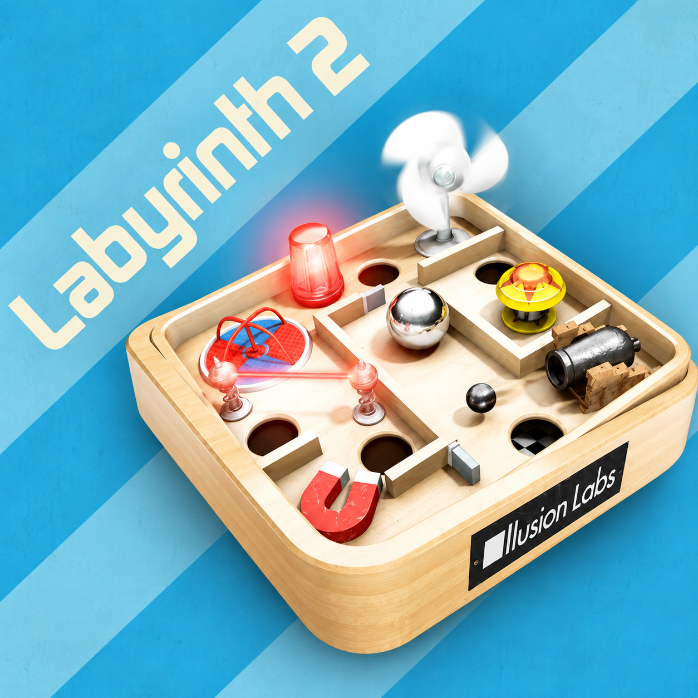

<div align="center">



# labyrinth2_nx

**Labyrinth 2 on Nintendo Switch**

An unofficial Nintendo Switch wrapper for the Android version of
**Labyrinth 2** by Illusion Labs.

[](#)
[](#)
[](#)
[](#)

</div>

---

## About

`labyrinth2_nx` runs the 32-bit (armeabi) Android build of **Labyrinth 2** on
Nintendo Switch. It loads the game's own engine library, `liblabyrinthii.so`,
and recreates the Android, JNI, libc, audio, input and graphics services it
expects under Horizon OS. The whole program runs in AArch32 (32-bit) mode,
like the game. The game's menus were Android Views, so they are rebuilt from
the APK's own layouts and pictures.

This release targets **Labyrinth 2 1.29** for Android
(`se.illusionlabs.labyrinth2`, versionCode 20, armeabi). You supply your own
APK: the game's code, levels, pictures and sounds come from it.

The NRO also carries the parts of **Labyrinth 2 HD 1.6.0** (the iPad game)
the port uses: its menus, in landscape, and its level packs, which play on
their larger boards.

Added on top of the game:

* Local play: two players on one console, a board each, racing through a
  level pack. iPad packs work too.
* The ghost ball: your best run of a level, replayed while you play. The
  Android build had the code but never used it.
* Download levels and Create work with Illusion Labs' level servers, which
  are still online, for both iPhone and iPad packs.
* Controller navigation on every menu, and motion controls with the
  Joy-Cons or the console.
* Levels fill the screen, turned a quarter, or stay upright.

---

## Controls

| Input | Action |
| --- | --- |
| **Left Stick / D-Pad** | Tilt the board; move in the menus and lists |
| **A** | Confirm; go into a list |
| **B** | Back; leave a list |
| **+** | Pause |
| **-** | Motion controls: the way the controller is held now is level |
| **ZL** | Motion controls on or off in a level; iPad levels in the menus |
| **ZR** | Level view full screen or upright; iPhone levels in the menus |
| **L / R** | Previous / next list |
| **X** | Add a pack to or remove it from the faves |
| **Y** | Play the chosen pack; refresh in Create |
| **Right Stick** | Scroll a list; pointer on the game's own screens |
| **Touchscreen** | Works as on a phone |

In a list, up and down move one pack at a time, faster while held. Right goes
to the chosen pack's levels and Play button.

Local play: Main menu > Multi player, then a pack. Each player tilts with
their own controller. A Joy-Con held sideways works on its own.

---

## Build

### Requirements

* Docker
* The AArch32 toolchain image `ghcr.io/vita2hos/devcontainer/vita2hos`
* [android32](https://github.com/aks796/android32), the runtime the 32-bit
  ports share, at `runtime/`: a submodule (`git clone --recursive`, or
  `git submodule update --init`).
* [libnx32](https://github.com/aks796/libnx32) 4.12.0 or newer, the 32-bit
  libnx. `build.sh` mounts its `prefix/` from a libnx32 checkout next to
  this one (`../libnx32`, built with its `./build.sh`), or from `DCR_LIBNX32`.
* [mesa32](https://github.com/aks796/mesa32): its `lib/` and `include/`
  copied into `portlibs32/`.

Both have prebuilt releases, which work as well as building them.
* `devkitpro/devkita64` (the 64-bit launcher)
* Python 3

Compile the wrapper and the launcher:

```bash
./build.sh
launcher/build.sh
```

The output is `launcher/labyrinth2_nx.nro`, which carries the 32-bit program
`labyrinth2_nx.nsp`. `tools/package_sd.sh` does both and lays out
`SD_CARD/` and `SD_CARD.zip`.

The launcher build also packs the iPad game's menu pictures and level packs
into the NRO, from your own Labyrinth 2 HD 1.6.0 `.ipa`
(`tools/make_ipad_assets.py`):

```bash
L2_IPA=/path/to/Labyrinth_2_HD_1.6.0.ipa launcher/build.sh
```

Without `L2_IPA` it uses the first `.ipa` next to the project. Without one,
the NRO has no iPad menus.

Host checks against your own APK:

```bash
tools/test_host.sh /path/to/labyrinth2.apk
tools/preview.sh /path/to/labyrinth2.apk
```

See [NOTES.md](NOTES.md) for how the port works and what the 32-bit
libraries need.

---

## Running

Requires Atmosphère and [sphaira](https://github.com/ITotalJustice/sphaira).

Put the NRO and your APK in this folder:

```text
sd:/switch/labyrinth2_nx/
├── labyrinth2_nx.nro
└── Labyrinth 2 1.29.apk
```

The APK file name does not matter. The same goes for the optional files:

* `HelveticaNeue.ttc` (or any font with "helvetica" in its name), the
  iPhone game's font
* an emoji font (any font with "emoji" in its name), for emoji in pack names
* level pack `.zip` files in `levelpacks/`

None of these come with the port.

1. In sphaira: **Homebrew > Labyrinth 2 > Install Forwarder**.
2. Launch the new **Labyrinth 2** icon on the HOME menu. The launcher
   installs the 32-bit program for that icon and restarts.
3. The first start unpacks the game's library, files and level packs from
   the APK, with a progress bar. Updates show it too.

Afterwards the folder looks like this:

```text
sd:/switch/labyrinth2_nx/
├── labyrinth2_nx.nro
├── Labyrinth 2 1.29.apk
├── config.ini
├── liblabyrinthii.so
├── classes.txt
├── data/
├── external/
├── levelpacks/
└── debug.log
```

Saves live in `data/`, including `device_id`, which holds your online ID.
Settings live in `config.ini`, which is written on the first launch and
explains each option.

To update, copy the new `labyrinth2_nx.nro` over the old one and launch the
icon. The game installs the newer build itself.

Coming from a build that used `sd:/switch/labyrinth2/Labyrinth2.nro`: put
`labyrinth2_nx.nro` in `sd:/switch/labyrinth2_nx/` and make a forwarder for
it. Its first start moves everything from `sd:/switch/labyrinth2/` into the
new folder. Then delete the old NRO and the old icon.

To undo, delete `atmosphere/contents/<the forwarder's title id>/exefs.nsp`
and uninstall the forwarder.

---

## Status

The game, the iPad menus and levels, local play, the ghost ball, online
level lists and downloads, audio, controllers, motion controls and the
touchscreen work on hardware.

Publishing a level pack from Create has had less testing. The iPhone game's
Wi-Fi and Bluetooth multiplayer is not available: the Android engine has no
network play.

The wrapper is built for **Labyrinth 2 1.29** for Android, armeabi, and
**Labyrinth 2 HD 1.6.0** for iPad. Other versions have not been tested.

---

## Credits

**Labyrinth 2 Nintendo Switch port**: aks796

**Labyrinth 2**: Illusion Labs. The level servers are Illusion Labs'.

The Android `.so` loader derives from the open-source Switch loader work by
Andy Nguyen (TheOfficialFloW) and fgsfds, ported to 32-bit with reference to
[vita2hos](https://github.com/xerpi/vita2hos) by xerpi.

The 32-bit toolchain and libnx port come from vita2hos. libnx is by the
switchbrew authors (ISC). Graphics use Mesa and libdrm_nouveau with
devkitPro's Switch patches.

Sounds are decoded with stb_vorbis and pictures with stb_image, both by Sean
Barrett (public domain). The SoftBank emoji table comes from
[emoji-data](https://github.com/iamcal/emoji-data) by Cal Henderson (MIT).

---

## Contributing

Bug reports and tested improvements are welcome. Include `debug.log` and, if
present, `crash.log` from `sd:/switch/labyrinth2_nx/`. If the game closed by
itself, include the newest report in `sd:/atmosphere/crash_reports/` as well.

---

## Disclaimer

This is an unofficial fan project and is not affiliated with, sponsored by or
endorsed by Nintendo or Illusion Labs. Labyrinth 2 and all related trademarks
belong to their owners.

The source contains no game code or assets. The NRO carries the menu
pictures and level packs of Labyrinth 2 HD that the iPad menus use. The game
itself comes from your own APK.
